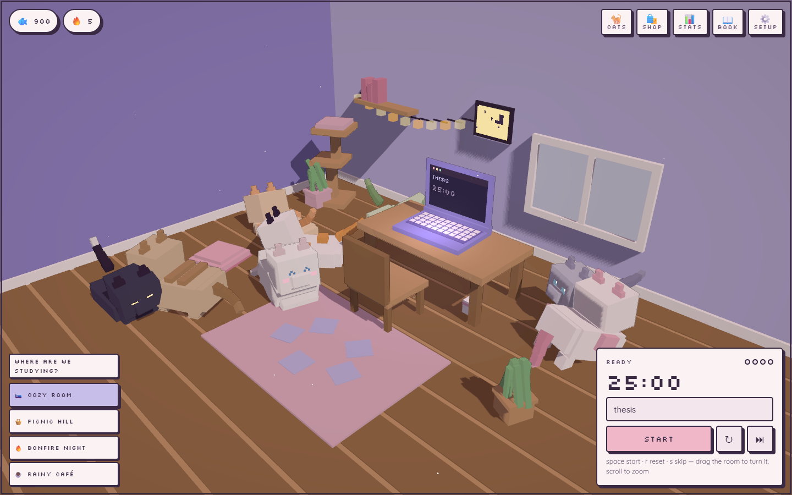

# Study With Cats 3D

> A pomodoro timer that is also a place. Focus sessions earn fish coins; fish coins grow a
> diorama of voxel cats. Finish a session and they get a snack.

No accounts, no ads, no analytics, no network calls after first load, and no way to spend real
money. Everything — including the fonts, the audio and the 3D — is local.



## Run it

```bash
npm install
npm run dev          # http://127.0.0.1:5173
```

```bash
npm run gate         # typecheck + unit tests + production build
npm run preview      # serve the built app on 127.0.0.1:4318
npm run gate:full    # the above, plus the layout and design probes (needs `preview` running)
```

## Controls

| | |
|---|---|
| `Space` | start / pause |
| `R` / `S` | reset / skip |
| drag the room | turn it (orbits between 180° and 270°) |
| scroll / pinch | zoom |
| click a cat | pet it |
| drag a cat | pick it up; drop it on the chair or a cat tower |
| double-click a cat | ask for a trick (needs bond level 3) |
| arrows / `+` `-` / `0` | turn, zoom and reset the view from the keyboard (focus the canvas first) |
| `Esc` | close a panel or leave photo mode |

Shortcuts are suppressed while you are typing in the task field.

## How it is put together

```
src/
├── core/          pure, unit-tested, no DOM and no Three.js
│   ├── timer.ts       pomodoro state machine (drift-free by construction)
│   ├── economy.ts     coins, streaks with freezes, bond XP
│   ├── feeding.ts     break-time claim/bite/cleanup model
│   ├── save.ts        versioned localStorage with migrations
│   ├── quests.ts  achievements.ts  state.ts  time.ts  rng.ts  events.ts
├── scene/         everything Three.js
│   ├── renderer.ts    composer: pixel pass -> bloom -> filter -> output
│   ├── camera.ts      spherical orbit rig with corner-fit framing
│   ├── cats/          catFactory (voxel build) · catAnimator (poses) · catBrain (behaviour)
│   ├── environments/  room · picnic · bonfire · cafe
│   ├── props/  fx/  picking.ts  world.ts  voxel.ts
├── ui/            HTML overlay: hud · panels · shop · stats · catalogue · photo · toasts
├── audio/         fully synthesized Web Audio (no files)
└── data/          breeds · snacks · furniture · quests · achievements · visitors · palette
```

Three design decisions carry most of the weight:

**The core is pure.** `timer`, `economy`, `feeding`, `save`, `quests` and `achievements` have no
DOM and no Three.js, so the rules of the game are tested headlessly and the 3D layer is only a
projection of them. The snack scene is the clearest case: claims live in `core/feeding.ts` and
nowhere else, which is why picking a cat up mid-meal cannot deadlock a snack and why ending a
break returns the exact set of objects to remove.

**The timer's truth is an absolute timestamp.** While running it stores `endsAt` and *derives*
the remaining time from `Date.now()`. Nothing accumulates, so a throttled tab, a closed laptop
and a page reload all resolve to the same number rather than to three different ones.

**Nothing punishes you.** Streaks freeze instead of resetting, bond levels only rise, and a
missed day is reported as weather. See `PRODUCT.md`.

## Verification

- `tests/` — 86 unit tests over the pure core, including a 3 000-operation fuzz that asserts the
  feeding invariants after **every** operation.
- `tools/geometry-probe.mjs` — measures computed layout in a real browser at 1440px and 390px
  (horizontal overflow, unclipped vertical overflow, sibling overlap, touch targets, accessible
  names). Run with `--selftest` it first injects a layout bug and a nameless button and refuses
  to report "clean" unless every rule goes red — a probe that has never failed is not evidence.
- `npx impeccable detect` — deterministic design-anti-pattern scan. One finding is waived, with
  its reasoning, in `.impeccable/config.json`.

## Documents

- `PRODUCT.md` — audience, voice, and the anti-references the UI must never resemble.
- `DESIGN.md` — the design contract: tokens, type, motion, and measured contrast ratios.
- `.claude/specs/study-with-cats-3d.spec.md` — the authoritative spec and acceptance criteria.

## Licence / assets

Quicksand and Silkscreen are under the SIL Open Font License and are vendored in
`public/fonts/`. Every other asset — models, textures, sounds — is generated at runtime by code
in this repository.
